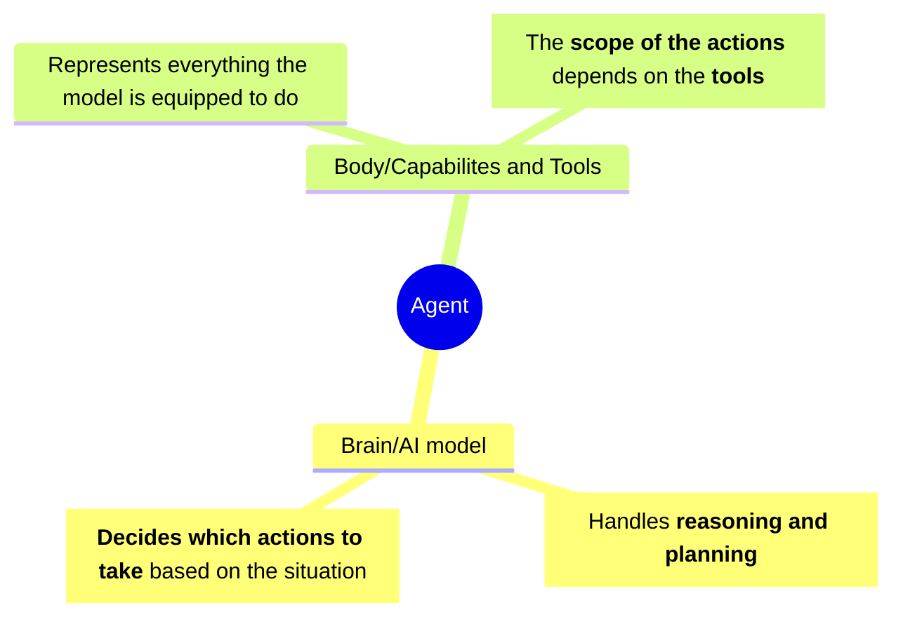

# Course description

[Course link](https://huggingface.co/learn/agents-course/unit0/introduction)

**Objectives**
- Study AI agents in **theory, design, and practice**
- Learn to **use established AI Agent libraries** such as [smolagents](https://huggingface.co/docs/smolagents/en/index), [LlamaIndex](https://www.llamaindex.ai/) and [LangGraph](https://docs.langchain.com/oss/python/langgraph/overview)

# Unit 1 - Introduction to Agents

## What is an Agent?

An **agent** is one who completes tasks, understands natural language, reasons and plans about the task to complete, and completes it using the tools it has access to.

> [!note] Definition
> An Agent is a system that leverages  an AI model to interact with its environment in order to achieve a user-defined objective. It combines reasoning, planning and the execution of actions (often via external tools) to fulfill tasks.

The most common models for agents are **LLMs**

They act through **tools**, the design of tools is very important and has  a great impact on the quality of your agent

> [!warning] Actions are not the same as Tools
> Actions are done **via** tools, one action can require multiple tools to complete

Examples:
- Personal virtual assistants, like Siri and Alexa
- Customer service chatbots
- AI NPCs in video games

## What are Tools?

A Tools is a **function given to the LLM**, some common tools are:

| Tool             | Objective                                                          |
| ---------------- | ------------------------------------------------------------------ |
| Web Search       | Allows the agent to fetch up-to-date information from the internet |
| Image Generation | Create images based on text descriptions                           |
| Retrieval        | Retrieves information from external sources                        |
| API Interface    | Interacts with an external API                                     |
