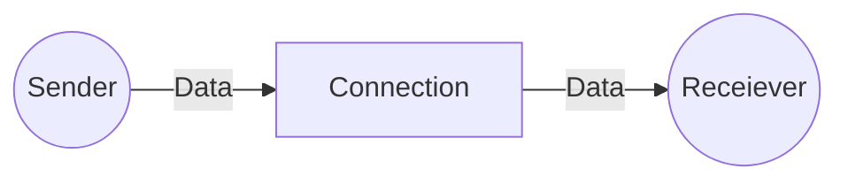

# Bibliography

[Tanenbaum, A. S. Computer Networks. Prentice-Hall, 2003.](https://csc-knu.github.io/sys-prog/books/Andrew%20S.%20Tanenbaum%20-%20Computer%20Networks.pdf)

**Las sig. notas son de el libro**

> [!important] ¿En qué capa atmosférica se encuentran los satélites?
> Termosfera y Exosfera

# Contents

[[#1.2 Network Hardware]]  
[[#1.3 Network Software]]

# 1. Introduction

## 1.2 Network Hardware

No hay una conjunto de categorías que clasifiquen perfectamente a las redes de computadora, pero si hay dos que son de mucha importancia: *transmission technology & scale*

### Classifying networks by transmission technology

Two major type: **broadcast** and **point-to-point** links

![[uni-and-broadcast.png]]

- **Point-to-Point**
	- Connect indivdual pairs of machines
	- To get to their destination, **packets** may have to visit intermediary machines, and there are many routes packets could take.
	- Point-to-Point networks where there is exactly one sender and one receiver can sometimes be called **unicast**
- **Broadcast**
	- The communication channel is shared by all machines, *packets sent by any machine, are received by all*
	- An **address field** within each packet specifies the intended recipient
	- When a machine receives a packet, if the address field matches (the packet was intended for the machine), it processes it, else it ignores it
	- Wireless networks are broadcast
	- As an analogy, consider someone standing in a meeting room and shouting ‘‘Watson, come here. I want you.’’ Although the packet may actually be received (heard) by many people, only Watson will respond; the others just ignore it.
	- Broadcast networks usually allow the possibility of addressing packets to *all* destinations, by using a special code in the address field, when this happens all machines in the network receive and process the packet, this is called **broadcasting**
	- Some networks support transmission to a *subset* of the machines, this is known as **multicasting**

### Classifying networks by scale

**Distance** is an important classification metric because *different technologies are used at different scales*

![[networks by scale.png]]

The connection of two or more networks is called an **internetwork**, the worldwide internet being the best example.

#### 1.2.1 Personal Area Networks

- **PANs** let devices communicate over the range of a person.
- **Bluetooth** is the best example of a PAN
- Bluetooth networks use the **master-slave paradigm**, the master tells the slaves what addresses to use, when they can broadcast, how long they can transmit, what frequencies they can use, and so on.

#### 1.2.2 Local Area Networks

- **Scale**: Operate within and nearby a single *building* (e.g. home, office)
- When LANs are used by companies, they are called **enterprise networks**
- **Modem**: Device that *converts digital signals into analog, and viceversa*

##### Wireles LANs

 - Very popular in homes, cafeterias, restaurants, etc.
 - In WLANs every computer has a radio modem and an antenna, each computer talks to an **Access Point (AP), wireless router, or base station**, these devices relay packets between the wireless computers, as well as between them and the internet.
 - WLANs follow the **IEEE 802.11**, also known as **WiFi**
![[wireless-vs-wired-lans.png]]

##### Wired LANs

- Use copper wires or optical fiber
- Compared to wireless networks, wired LANs have higher speeds (up to 1 Gbps, and some up to 10 Gbps), low delay and make very few errors, they *exceed them in all dimensions of performance* 
- The most common topology for wired LANs is *point-to-point links*, they follow the **IEEE 802.3** standard, commonly called **Ethernet**
- In **Switched Ethernet** every computer speaks the Ethernet protocol and connects to a box called a **switch** by a point-to-point link. A switch has multiple **ports** which connect computer to the switch. The switch functions as a **relay** for packets between computers that are attached to it

##### Virtual LANs

- It is possible to divide one large *physical* LAN into two smaller *logical* LANs, and it is useful when the network layout does not match the organization's structure
- To do this, **each port is tagged with a "color"**, say green for VLAN1 and red for VLAN2. The switch then forwards packets so that computers attached to ports of one color are separated from the computers attached to ports of another color
- This way, we can *broadcast packets to certain VLANS*

##### Static and Dynamic Allocation

- There are other topologies for wired LANs, *switched Ethernet is a modernized version of the original Ethernet*, which we will call **classic Ethernet**
- In classic Ethernet all packets are broadcasted in a single linear cable, *at most one machine could successfuly transmit at a time*, because of this a mechanism was needed to resolve conflicts. The mechanism was simple, computers could only transmit whenever the cable was idle, if two or more packets collided, each computer waited a random amount of time and tried again.
- *B*

## 1.3 Network Software 

### 1.3.1 Protocol Hierarchies

- In the early days, networks were designed hardware-first, and the software was an afterthought, those days are no more, *network software is now highly structured*
- To reduce their design complexity, most networks are organized as a stack of **layers** or **levels**, **each one built upon the one below it**. The purpose of this design is **to abstract the details of the lower layers, to be able to communicate with it**
- A **protocol** is an agreement between the communicating parties on how communication is to proceed, and is how the communication occurs between the n-th layer of one machine, and the n-th layer of another machine
![[network-layers-diagram.png]]

- **Peers**: The entities comprising the corresponding layers in different machines. They could be software processes, hardware devices or even human beings.
- **Physical medium**: Where the communication actually occurs
- **Interface**: The interface defines the operations and services the lower layer makes available to the upper one. In the diagram, interfaces are located *in between each pair of layers*
- Interfaces allow for **easily replacing a layer with a different implementation or protocol**, given that as long as it complies with the interface, the implementation doesn't matter
- A set of layers and protocols is called a **Network Architecture**, it must contain the necessary information to allow its implementation (whether it's a program or hardware)
- A list of the protocols used by a certain system, one for each layer, is called a **Protocol Stack**
- **Header**
- The peer process abstraction is *crucial to all network design*, without it designing a complete network would be too daunting. Now with it, it can be broken into several manageable tasks (designing each layer)

> [!note]- The Philosophers Analogy
> ![[philosophers-network-analogy.png]]

### 1.3.2 Design Issues for the Layers

- **Error Detection:** Code for knowing when the information received was damaged
- **Error Correction:** More powerful technology, allows for the correct message to be **recovered** from the damaged message
- **Routing:** In large networks there are multiple ways the packets can go through, and there can be multiple broken links or routers. *The network should automatically find a working path*
- **Protocol Layering**: Key mechanism that allows networks to connect to new technologies or designs, and overall, to easily adapt
- **Addressing/Naming:** Mechanism that allows layers to identify senders and receivers involved in a particular message
- **Internetworking:** When connecting multiple networks, problems can arise like having networks that preserve the order in messages and networks that don't. Or having networks that don't share the maximum message size for transmission. These conflicts lead to the creation of mechanisms that allow compatibility between networks; both the conflicts and the mechanisms are called *Internetworking*
- **Scalable:** Characteristic of networks that are designed to continue to work *well* when the network gets large
- **Statistical Multiplexing:** Share bandwidth *dynamically*, based on the statistics of demand
- **Flow Control:** Mechanisms to keep a fast sender from drowning a slow receiver with data
- **Congestion:** Overloading of the network, occurs when the network is connected to too many computers, which want to send too much traffic, and the network can't handle it
- **Real-Time**, **Quality of Service**
- **Confidentiality**, **Authentication**, **Integrity**

### 1.3.3 Connection-Oriented Versus Connectionless Service

#### Connection-Oriented Service

- First **establish a connection**, then use the connection, and finally release it.

- In most cases **the order of the messages is preserved**
- In some cases when a connection is established, the sender, the receiver and the subnet, conduct a **negotiation** about the parameters to be used, like maximum message size, quality of service required, etc. In negotiations, typically one side makes a proposal, and the other side accepts it, rejects it, or makes a counter-proposal

## 1.4 Reference Models

### The OSI Reference Model

#### The Physical Layer

- Transmits raw bits over a communication channel
- Decides what voltage is 1 or 0, how long should the signal last, etc.

#### The Data Link Layer

- 

# 23 - Oct - 25

## Transmision de Radio

- Viajan largas distancias
- A bajas frecuencias atraviesan edificios
- Son omnidireccionales
- A altas frecuencias la señal viaja en línea recta, rebota en los objetos y la lluvia las absorbe
- Sufren interferencia por motores y equipos eléctricos, los autos nuevos tienen un filtro para contrarestar la interferencia
- Las bandas de las frecuencias VLF, LF y MF siguen la curvatura de la tierra. Teniendo un alcance de hasta 1000 km.
- Las estaciones de radio AM