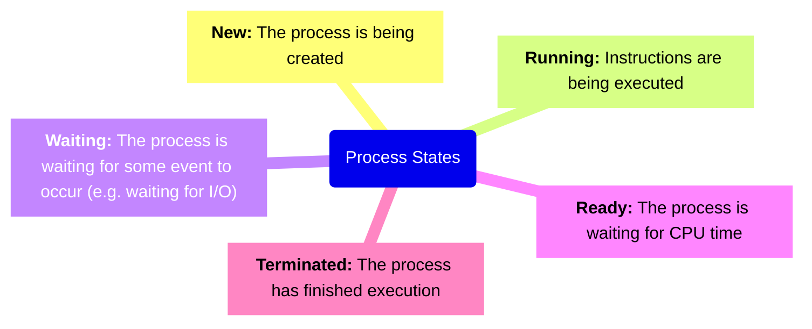

# Bibliografia

- [Silberschatz, A., Galvin, P., & Gagne, G. (2014). _Operating System Concepts Essentials_ (Segunda edición ed.). Wiley.](https://www.pdfiles.net/storage/Books/operating-systems/operating_system_concepts_essentials.pdf)
- [Silberschatz. A., Galvin, P., & Gagne, G. (2018). *Operating System Concepts (Decima edición ed.). Wiley*](https://os.ecci.ucr.ac.cr/slides/Abraham-Silberschatz-Operating-System-Concepts-10th-2018.pdf)
- [Playlist Videos Relevantes](https://youtube.com/playlist?list=PLv_ocwVAliKCkxT19pJUx8Lr2BjJfSlQM&si=QjVBIfE-EclQaCbF)
- [Unidad II](https://github.com/omarpach/7sem/blob/main/sistemas-operativos/bibliografia/Unidad%20II-%20Procesos%20y%20tareas.pdf)

# Chapter 3 - Processes

## 3.1 Process Concept

- **Process**
	- A program in execution, can be either a *user program* or an *operating system task*
	- Unit of work of modern Operating Systems
	- Interchangeable with job
	- A process contains the *text section, program counter, stack, data section, heap*

![[process-in-memory.png]]
### 3.1.2 Process State

- As a process executes, it changes **state**, state is defined by the current activity of the process.

**Process State Diagram/Process Lifecycle**

![[process-state-diagram.png]]

### 3.1.3 Process Control Block

- Each process is represented in the operating system by a **Process Control Block (PCB)**, also known as **Task Control Block (TCB)**

![[pcb-diagram.png]]

- A PCB contains the following:
	- **Process State**
	- **Program Counter**: Holds the address of the next instruction to be executed for this process
	- **CPU Register**: